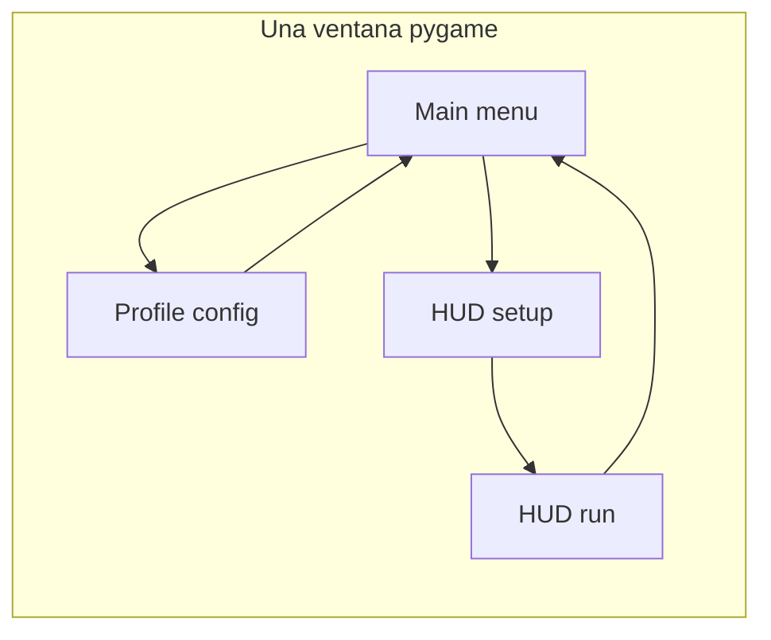

# 🕹️ Arcade HUD Overlay (Windows)

Visualizador gráfico de entradas tipo arcade para joystick o teclado, diseñado como overlay para emuladores.
Perfecto para tutoriales de juegos de pelea, demostraciones de habilidad o como herramienta de entrenamiento.

> [!NOTE]
> Este proyecto (`hud_owerlay`) prioriza estabilidad en Windows con un enfoque conservador de cambios.

## Estado actual del proyecto (Marzo 2025)

- **Ventana única:** menús, configuración y mapeos usan la misma superficie pygame (sin `set_mode` secundario).
- Estructura modular: `config/`, `maps/`, `profiles/`, `render/`, `training/`, `utils/`, `json/`
- **Teclado:** intento de captura global con `keyboard` en Windows; si no hay hook o se desactiva, lectura con **foco** vía `pygame` (`HUD_KEYBOARD_GLOBAL=0` fuerza solo foco).
- Capa `maps/keyboard_backend.py` aísla la lógica de teclado global.
- **Layout HUD:** campo `hud_layout` por perfil (stick + botones en coordenadas de diseño); editor en Configuración → «Editor layout HUD».
- Perfiles y bindings en `%APPDATA%\\hud_owerlay\\profiles.json`; export/import ZIP incluye `hud_layout` normalizado.
- Estados lógicos en [`state_manager.py`](state_manager.py): `BootState`, `MainMenuState`, `ModalState`, `ProfileConfigState`, `HudSetupState`, `HudRunState`; `HudLayoutEditorState` vive como subflujo dentro del menú de perfiles ([`render/hud_layout_editor.py`](render/hud_layout_editor.py)). Contexto compartido: [`application_context.py`](application_context.py).
- Soporte para 4, 6 u 8 botones; modos hitbox y mixbox

## Características

**Windows-only.** Este proyecto es exclusivo para Windows.

- Representación virtual de un Fightstick
- HUD gráfico en Pygame como overlay encima de otros programas
- Joystick arcade virtual y hasta 8 botones (configurables)
- Modo joystick y modo teclado
- Formatos de 4, 6 u 8 botones con layout adaptativo
- Íconos personalizables por botón (lp.png, hp.png, etc.)
- Modo torneo y modo entrenamiento standalone

## Estructura del proyecto

```
hud_owerlay/
├── main.py              # Menú principal, HUD overlay
├── configure.py         # Configuración de ventana
├── tournament.py        # Modo torneo
├── requirements.txt
├── config/              # Configuración y rutas
├── maps/                # input_reader, keymapper, joystick_mapper
├── profiles/            # profile_store, profile_export
├── render/              # hud_renderer, selectores, menú de perfiles
├── training/            # recorder, standalone
├── utils/               # file_picker, image_file_picker, utilidades
├── json/                # datos base de repo (la app usa AppData en runtime)
├── fonts/               # Fuentes Nerd Font
└── icons/               # lp.png, mp.png, hp.png, ...
```

## Requisitos

- Python 3.7+
- Windows 8.1 o superior

## Instalación

```bash
git clone https://github.com/Cat-Not-Furry/hud_owerlay.git
cd hud_owerlay
pip install -r requirements.txt
```

## Empaquetado e instalador Windows

El flujo oficial para generar el `.exe` empaquetado y el instalador `.exe` esta documentado en:

- [`constructor.md`](constructor.md)

Este flujo es manual y se ejecuta en la PC Windows despues de `git pull`.  
No se ejecuta automaticamente desde este repositorio.

Archivos de instalación (Windows):

- `install/installer.iss`
- `install/install_windows.bat`
- `install/update_windows.bat`
- `install/hud_overlay.ico` (icono del instalador)

Bitácora activa:

- [`bitacora.md`](bitacora.md)

## Uso (Entrypoints)

| Comando | Descripción |
|---------|-------------|
| `python main.py` | Menú principal: configurar perfiles, iniciar HUD, training, easteregg |
| `python configure.py` | Configuración rápida de ventana |
| `python tournament.py` | Modo torneo (ventana fija) |
| `python cli.py --help` | CLI unificado (doctor, version, rutas de soporte) |
| `python doctor.py` | Diagnóstico de entorno y dependencias |

## Notas técnicas

- Perfiles y bindings se guardan en `%APPDATA%\\hud_owerlay\\profiles.json`
- Los íconos de botones están en `icons/` y se pueden personalizar
- Si existía `userdata/`, la migración a `json/` se realiza automáticamente al iniciar
- Variable de entorno `HUD_KEYBOARD_GLOBAL=0`: solo teclado con ventana enfocada (útil si `keyboard` falla o no quieres hook global).
- Variable de entorno `HUD_SKIP_TKINTER_RUNTIME_CHECK=1`: omite el runtime-check GUI de tkinter en `doctor`.
- Pruebas mínimas: `python -m unittest discover -s tests`

## Arquitectura (resumen)



## Créditos

Desarrollado con amor al fighting 🕹️ y la ayuda de ChatGPT.
